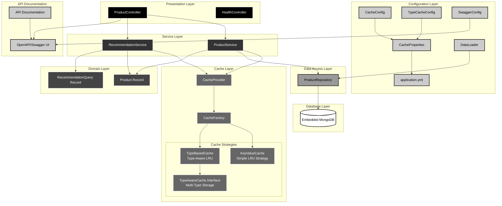
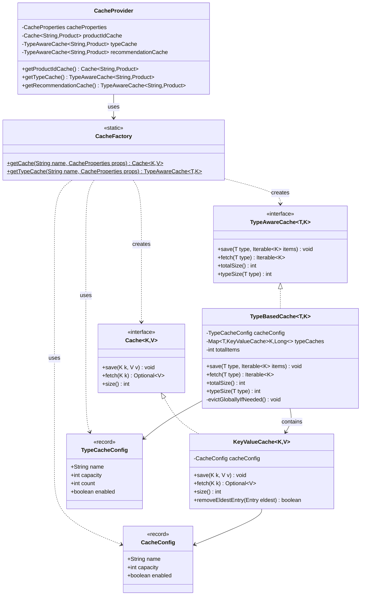
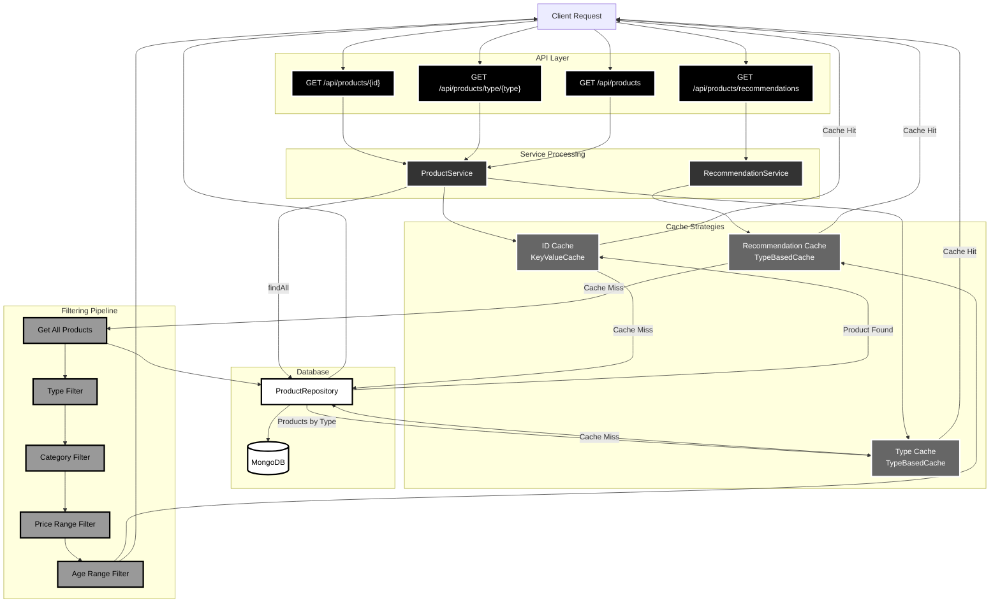
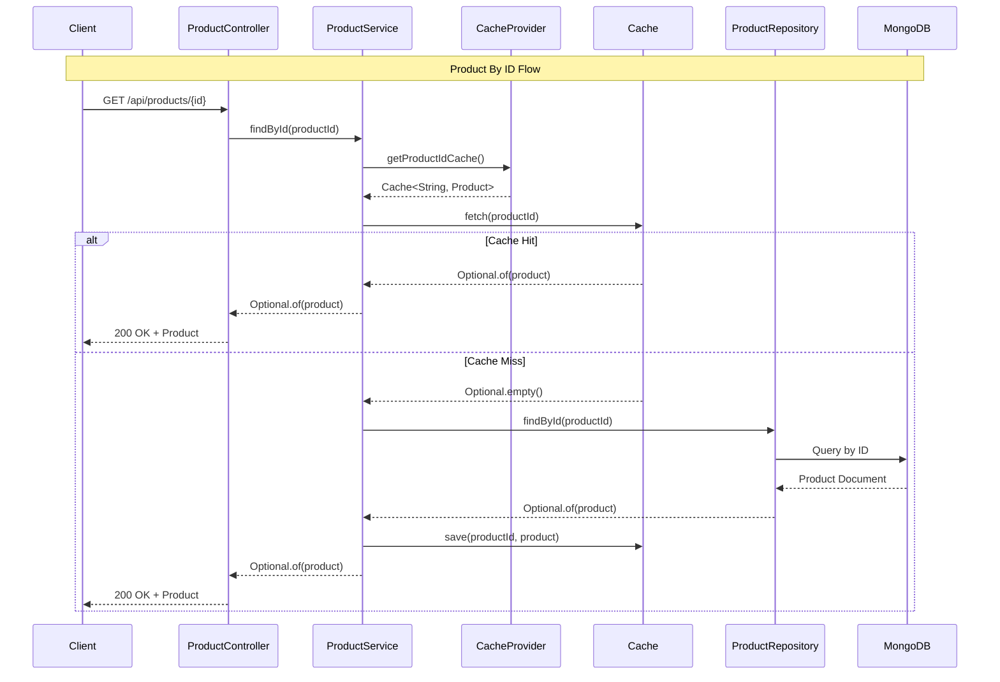
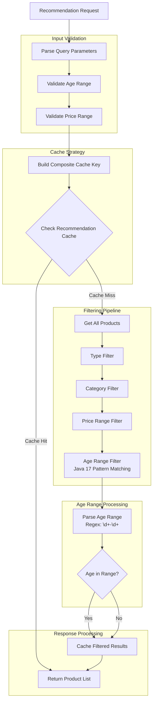

# Product Services - Architecture Documentation

This document provides comprehensive architectural diagrams for the Product Services application, demonstrating clean architecture principles, design patterns, and caching strategies.

## 1. Overall System Architecture

## 2. Cache Strategy Pattern Implementation

## 3. Data Flow Architecture

## 4. Component Interaction Sequence

## 5. Recommendation Engine Flow

## 6. LRU Cache Eviction Strategy

```mermaid
graph TD
    subgraph "KeyValueCache (Simple LRU)"
        KV_Insert[Insert Key-Value]
        KV_Check{Size > Capacity?}
        KV_Evict[Remove Eldest Entry]
        KV_Store[Store in LinkedHashMap]
    end
    
    subgraph "MultiValueCache (Type-Based LRU)"
        MV_Insert[Insert Key-Values]
        MV_Count[Update Total Value Count]
        MV_Check{Total Values > Capacity?}
        MV_EvictKey[Remove Entire Key<br/>with All Values]
        MV_Store[Store in Partitioned Cache]
    end
    
    subgraph "Recommendation Cache (Composite-Key LRU)"
        RC_BuildKey[Build Composite Key<br/>from Query Parameters]
        RC_Insert[Insert Filtered Results]
        RC_Evict[LRU Eviction by Query Key]
    end

    KV_Insert --> KV_Check
    KV_Check -->|Yes| KV_Evict
    KV_Check -->|No| KV_Store
    KV_Evict --> KV_Store
    
    MV_Insert --> MV_Count
    MV_Count --> MV_Check
    MV_Check -->|Yes| MV_EvictKey
    MV_Check -->|No| MV_Store
    MV_EvictKey --> MV_Store
    
    RC_BuildKey --> RC_Insert
    RC_Insert --> RC_Evict
```

## 7. SOLID Principles Implementation

```mermaid
graph TD
    Root["SOLID Principles"]
    
    S["S - Single Responsibility"]
    O["O - Open/Closed"]
    L["L - Liskov Substitution"]
    I["I - Interface Segregation"]
    D["D - Dependency Inversion"]
    
    PC["Controllers handle HTTP"]
    PS["Services handle business logic"]
    CP["Manages cache instances"]
    PR["Data access only"]
    
    CI1["Cache interface for extension"]
    SP["New cache strategies without modification"]
    
    CImpl["All cache implementations interchangeable"]
    
    CI2["Focused cache interface"]
    RI["Specific repository methods"]
    
    SD["Services depend on abstractions"]
    CInj["Configuration through interfaces"]

    Root --> S
    Root --> O
    Root --> L
    Root --> I
    Root --> D
    
    S --> PC
    S --> PS
    S --> CP
    S --> PR
    
    O --> CI1
    O --> SP
    
    L --> CImpl
    
    I --> CI2
    I --> RI
    
    D --> SD
    D --> CInj

    %% Styling
    classDef root fill:#000000,stroke:#ffffff,stroke-width:3px,color:#ffffff
    classDef principle fill:#333333,stroke:#ffffff,stroke-width:2px,color:#ffffff
    classDef implementation fill:#666666,stroke:#ffffff,stroke-width:2px,color:#ffffff
    
    class Root root
    class S,O,L,I,D principle
    class PC,PS,CP,PR,CI1,SP,CImpl,CI2,RI,SD,CInj implementation
```

## Key Architectural Decisions

### 1. **Layered Architecture**
- Clear separation of concerns
- Each layer has single responsibility
- Dependencies flow downward only

### 2. **Dual Cache Strategy Pattern**
- **KeyValueCache**: Simple LinkedHashMap-based LRU for individual items
- **TypeBasedCache**: HashMap-based multi-type storage with global eviction
- Factory creates appropriate cache implementation based on configuration
- Runtime cache strategy selection via configuration

### 3. **TypeAware Caching Interface**
- Abstraction for type-organized caching operations
- Support for bulk operations with Iterable inputs/outputs
- Flexible eviction policies across type boundaries
- Per-type capacity and global count management

### 4. **Java 17 Features**
- Records for immutable domain models (Product, RecommendationQuery, CacheConfig)
- Pattern matching for age range parsing in recommendation engine
- Modern language constructs for cleaner, more expressive code

### 5. **Thread Safety**
- Synchronized cache operations for concurrent access
- HashMap usage with synchronization in TypeBasedCache
- Thread-safe LRU implementations

### 6. **Interactive API Documentation**
- SpringDoc OpenAPI 3 integration
- Swagger UI for real-time API testing
- Comprehensive endpoint documentation with examples

### 7. **Configuration-Driven Design**
- Separate configuration structures for different cache types
- Environment-specific settings via application.yml
- Runtime behavior modification without code changes
